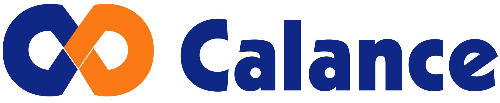

# Who we are

Calance is a global IT Services firm specializing in end-to-end solutions for Development, Robotic Process Automation (RPA), Business Intelligence and Data Science, DevOps enablement, Managed Services, Security, Construction Management Software Integration and IT Staffing.

Headquartered in Southern California, our team has made a commitment to excellence for over 20 years. We continue to evolve and change to meet current needs of our customers. Our logo represents two parties joining hands and creating a lasting alliance, similar to the ones we create with our customers.

Our culture is one of collaboration, where we strive to make all of our team members feel welcome and appreciated. We work well together, and our main priorities include providing world-class IT services, providing a customer-centric experience, and ensuring that our employees enjoy working with us. As our team grows to 8 offices worldwide, our ability to put customers first and adapt to their needs remains the cornerstone of our business.
